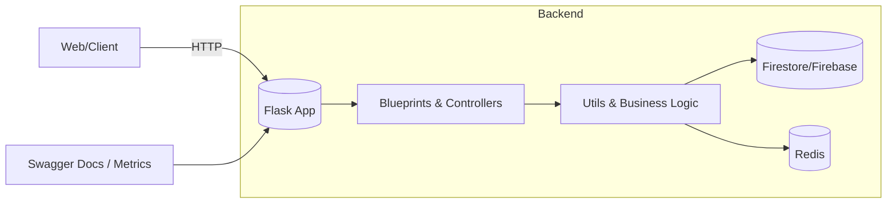

# RetailGenie

[](https://github.com/deepakbajaj12/RetailGenie/actions/workflows/ci.yml)
[](https://codecov.io/gh/deepakbajaj12/RetailGenie)

Professional, full-stack retail analytics app with a Flask backend and Next.js frontend.

## Quickstart

### Backend (Windows PowerShell)
```powershell
cd backend
./scripts/start.ps1         # dev run (creates .venv, installs deps)
# or
./scripts/start_optimized.ps1
# or
./scripts/start_production.ps1
```

### Backend (macOS/Linux)
```bash
cd backend
./scripts/start.sh          # or: python -m venv .venv && source .venv/bin/activate
pip install -r requirements.txt
python app.py
```

### Frontend (Next.js)
```powershell
cd frontend
npm install
npm run dev
# open http://localhost:3000
```

Create `frontend/.env.local` with:
```
NEXT_PUBLIC_API_BASE_URL=http://localhost:5000
```

### Environment Variables
- Backend: copy `backend/.env.example` to `backend/.env` and set values.
- Frontend: create `frontend/.env.local` (see above) or copy from example if present.

## Contributing & Security
- See `CONTRIBUTING.md` for development workflow, testing, and style.
- See `SECURITY.md` for reporting vulnerabilities.

## CI/CD
- GitHub Actions runs code quality checks, tests (with coverage), security scans, and optional performance/load tests.
- Coverage threshold: builds fail if coverage drops below 70% (see pytest `--cov-fail-under=70`).

## Architecture



## API Docs
- Health: `GET /health`
- Products: `GET /api/products`, `POST /api/products`, etc.
- Swagger (standalone server): run `backend/monitoring/swagger_docs.py` and open `http://localhost:5002/docs/`.

### Base URLs
- Backend API: `http://localhost:5000`
- Frontend App: `http://localhost:3000`

### Troubleshooting
- `net::ERR_CONNECTION_REFUSED`: ensure the backend is running and the frontend `.env.local` uses a full URL (`http://localhost:5000`).
- `404 Not Found`: verify the path/method matches routes in `backend/app.py`.
- `chrome-extension://invalid net::ERR_FAILED`: benign extension logs; unrelated to the app.

### AI Endpoints
- `POST /ai/summarize-feedback`
	- Body: `{ "product_id": "<id>" }` or `{ "feedback": [{"rating": 5, "comment": "..."}] }`
	- Uses OpenAI if `OPENAI_API_KEY` is set; otherwise returns a heuristic summary.
- `POST /ai/generate-description`
	- Body: `{ "name": "...", "category": "...", "features": ["..."], "tone": "concise|playful|technical" }`
	- Returns a short marketing description. Configure model via `OPENAI_MODEL`.

#### Semantic Search & Recommendations
- `POST /ai/index-products`
	- Body (optional): `{ "products": [{ id, name, description, category, ... }] }`
	- If not provided, tries to pull from `products` collection. Stores vectors in `backend/data/embeddings_index.json`.
	- Requires `OPENAI_API_KEY` for real embeddings; falls back to zero vectors otherwise.
- `POST /ai/semantic-search`
	- Body: `{ "query": "text", "top_k": 5, "category": "optional" }`
	- Returns similar products with cosine similarity scores.
- `POST /ai/recommendations`
	- Body: `{ "product_id": "..." }` or `{ "product": {...} }`
	- Returns similar products in the same category ranked by vector similarity.

#### Weekly AI Insights
- `POST /ai/insights`
	- Body (optional): `{ sales: [...], inventory: [...], feedback: [...] }` else attempts to read from Firebase collections.
	- Produces actionable weekly suggestions; uses LLM to summarize if available.

## Dev Container
- Open in VS Code with Dev Containers; Python 3.12 and Redis are pre-wired.
- Post-create installs deps and pre-commit automatically.
 - Frontend can be run locally in your host or via a separate Node dev container if desired.

## Embeddings Reindex
- Local (SQLite default): `python backend/scripts/index_products.py --file backend/data/sample_products.json`
- Force JSON store: `python backend/scripts/index_products.py --file backend/data/sample_products.json --store json`
- CI: Nightly job `Nightly Embeddings Reindex` builds the index and uploads it as an artifact.

### Vector Store Backends
- Default: SQLite file `backend/data/embeddings_index.sqlite` (set via `VECTOR_DB_PATH`).
- Fallback: JSON file `backend/data/embeddings_index.json`.
- Configure via env: `VECTOR_STORE=sqlite|json`.
# RetailGenie
